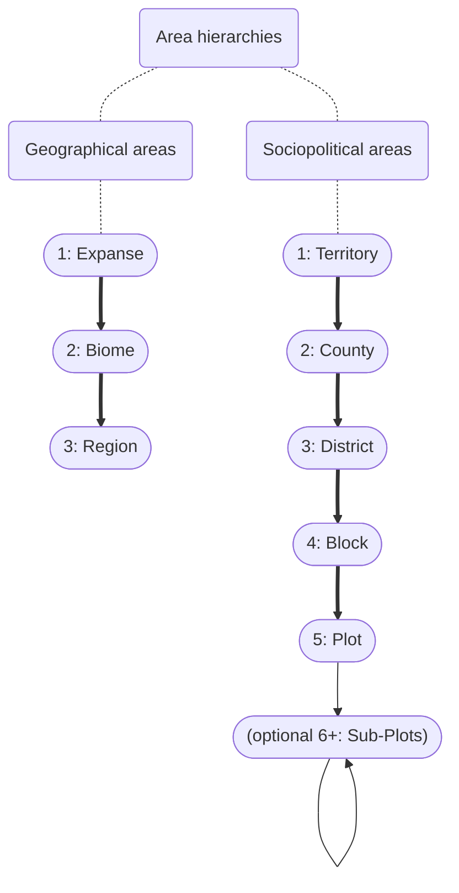
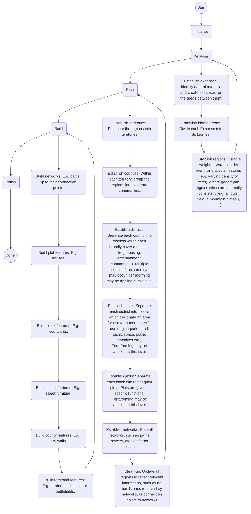
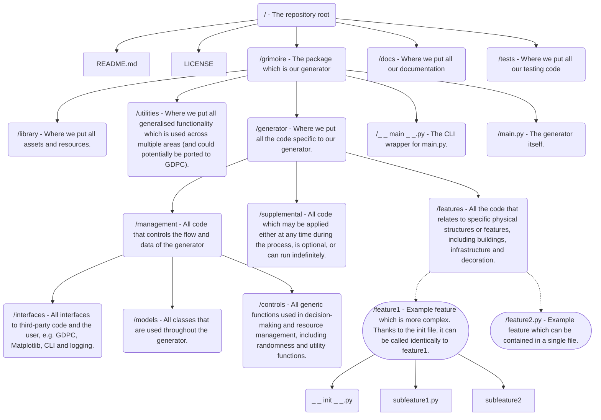

## Hierarchies
In principle, there should be two separate ways of dividing the build area: Geographical and sociopolitical areas.

On the geographical side:
- Expanses: The expanses fill the areas up to natural barriers (e.g. of a deep river or mountain range).
- Biome areas: The biome areas fill each contiguous area of the same biome, up to the edge of the expanse.
- Regions: Sub-divisions of the biome areas based on the contents (think of this like sub-biomes), or as a means of dividing a largely featureless area into smaller parts.

And, based on the geography:
- Territories: The territories are a contiguous collection of regions within the same expanse, which are either suitable or unsuitable for habitation. Each territory suitable for habitation could spawn one or multiple settlements of the same culture/nation/ethnicity/... .
- Counties: The counties are contiguous collections of regions (typically of the same biome) within the same territory, and are generally either rural or urban. These often form some kind of community, with distinct cultural or architectural differences that still have elements in common with the other counties of their territory.
- Districts: Within each county, the space is further subdivided into areas of specialty. From this level down, more or less emphasis may be placed on geographical areas, and terraforming may take place. Rural places might differentiate between farmland, forests, and villages for example; while urban areas might have different wealth or industry across different districts.
- Blocks: Blocks are a sub-division of districts which may even further specialise, or just cause further grouping within the district to aid navigability.
- Plots: Plots are distinct areas of land that are designated for a specific purpose or structure, such as housing or other buildings, features, or for greenery.
- Sub-plots: Optionally, a plot may decide to further dub-divide itself, but these subdivisions are't typically visible for any higher levels of the hierarchy. The plot acts as the smallest area of interest, but sub-plots may cause modifications to the properties of the plot (for example, allowing other systems to differentiate a park with a playground or pond from one that does not have these features).

## Generative process

The process generally follows the sequence of
1. Initialise: Set up generator and its starting parameters.
2. Analyse: Inspect the geography, creating geographical areas and synthesising information on the build area. A top-down process. In this phase, certain areas of the build region may be ignored for further analysis as a means of optimisation.
3. Plan: Consolidate the regions into sociopolitical areas, and impose constraints on the next-lower level. A top-down process.
4. Build: Decide what to build based on the constraints, and propagate the decision to the next-higher level to aid feature coordination. List optional or optimisation tasks to be completed later. A buttom-up process.
5. Polish: Pick up optional or optimisation tasks based on priority to fill the remaining time. A chaotic process.

## Repository Structure

Each feature should be able to provide results for planning and building, and may also return optional callables as a result of building, which may be executed during the polishing phase.

